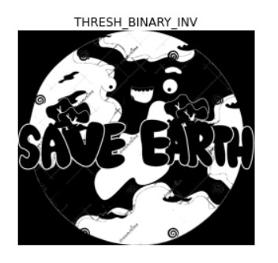
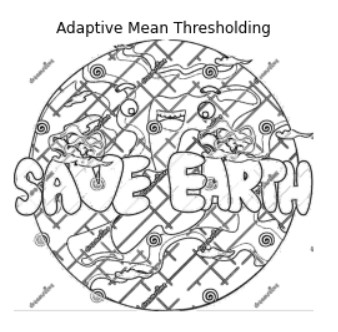
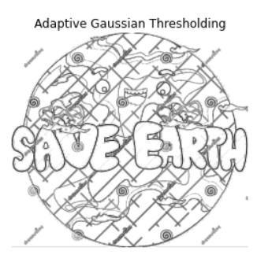

# Thresholding of Images
## Aim
To segment the image using global thresholding, adaptive thresholding and Otsu's thresholding using python and OpenCV.

## Software Required
1. Anaconda - Python 3.7
2. OpenCV

## Algorithm

### Step1:
Import packages cv2 and matplotlib.
<br>

### Step2:
Read the image and convert it into grayscale image.
<br>

### Step3:
Perform Global thresholding method.
<br>

### Step4:
Perform Adaptive thresholding method.
<br>

### Step5:
Perform optimum global thresholding by otsu method.
<br>

### Step6:
Run the programs and show the outputs.
<br>

## Program
~~~
Program developed by: SUBRAMANIYA PILLAI B
Register number: 212221230109
~~~

```python
# Load the necessary packages
import cv2
import matplotlib.pyplot as plt


# Read the Image and convert to grayscale
image=cv2.imread('nissan.jpg')
gray=cv2.cvtColor(image,cv2.COLOR_BGR2GRAY)
plt.imshow(gray,cmap='gray')
plt.axis('off')


# Use Global thresholding to segment the image
ret, thresh1=cv2.threshold(gray, 100, 200, cv2.THRESH_BINARY)
ret, thresh2=cv2.threshold(gray, 100, 200, cv2.THRESH_BINARY_INV)
ret, thresh3=cv2.threshold(gray, 100, 200, cv2.THRESH_TRUNC)
ret, thresh4=cv2.threshold(gray, 100, 200, cv2.THRESH_TOZERO)
ret, thresh5=cv2.threshold(gray, 100, 200, cv2.THRESH_TOZERO_INV)


# Use Adaptive thresholding to segment the image
th1=cv2.adaptiveThreshold(gray,255,cv2.ADAPTIVE_THRESH_MEAN_C,cv2.THRESH_BINARY,11,2)
th2=cv2.adaptiveThreshold(gray,255,cv2.ADAPTIVE_THRESH_GAUSSIAN_C,cv2.THRESH_BINARY,11,2)


# Use Otsu's method to segment the image 
ret,th7=cv2.threshold(gray,0,255,cv2.THRESH_BINARY+cv2.THRESH_OTSU)


# Display the results
plt.imshow(thresh1,cmap='gray')
plt.imshow(thresh2,cmap='gray')
plt.imshow(thresh3,cmap='gray')
plt.imshow(thresh4,cmap='gray')
plt.imshow(thresh5,cmap='gray')
plt.imshow(th1,cmap='gray')
plt.imshow(th2,cmap='gray')
plt.imshow(th7,cmap='gray')

```
## Output

### Original Image

### Grayscale Image

<br>

### Global Thresholding:


<br>


<br>


<br>


<br>
<br>
<br>

### Adaptive Thresholding



<br>
<br>
### Optimum Global Thesholding using Otsu's Method

<br>

## Result
Thus the images are segmented using global thresholding, adaptive thresholding and optimum global thresholding using python and OpenCV.


